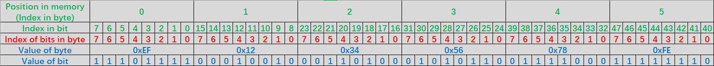

# Bixet：应用层数据解析工具集
---
### 本文内容
>#### [1. 项目描述](#项目描述)
>>##### [1-1. 项目介绍](#项目介绍)
>>##### [1-2. 项目依赖](#项目依赖)
>>>###### [1-2-1. 运行环境](#运行环境)
>>>###### [1-2-2. 项目依赖命名空间](#项目依赖命名空间)
>>##### [1-3. 使用方法](#使用方法)
>>##### [1-4. 数据内存布局](#数据内存布局)
>#### [3. BReader类](#BReader类)
>>##### [3.1 BReader示例](#BReader示例)

---
## 项目描述
### 项目介绍
&nbsp;&nbsp;&nbsp;&nbsp;&nbsp;&nbsp;&nbsp;Bixet是一组工具集合，为用户提供对以字节流或比特流形式表示的数据进行操作的若干功能。不同的功能被实现为不同的类以供用户使用。本项目计划支持的功能及其最新实现版本如下所示：

|类名|功能|最新实现版本|
|-|-|-|
|__BUtil__|对字节流或比特流进行操作的工具方法集|0.2.0|
|__BReader__|从数据指定字节位置/比特位置处依照指定字节序/比特序读取指定长度的数值或字符串|0.4.0|
|__BWriter__|向数据指定字节位置或比特位置处依照指定字节序/比特序写入指定长度的数值或字符串|0.3.0|
|__BTemplete__ & __BBlock__ & __BVariable__|将数据格式描述为形式化模板|0.1.0 & 0.1.0 & 0.1.0|
|__BResolver__|依照数据格式模板对数据进行自动化的解析与填充|待实现|
###### [<p align="right">返回目录</p>](#本文内容)
***
### 项目依赖
### 运行环境
    .Net Framework 4.7.2及以上版本
###### [<p align="right">返回目录</p>](#本文内容)
***
### 项目依赖命名空间

    1. Newtonsoft.Json
    2. FluentAssertions
    3. Microsoft.VisualStudio.TestTools.UnitTesting
###### [<p align="right">返回目录</p>](#本文内容)
***
### 使用方法
&nbsp;&nbsp;&nbsp;&nbsp;&nbsp;&nbsp;&nbsp;在.Net项目中引用编译后的**Bixet.dll**，并在自己程序中需要的位置添加对命名空间的使用。
###### [<p align="right">返回目录</p>](#本文内容)
***
### 数据内存布局
&nbsp;&nbsp;&nbsp;&nbsp;&nbsp;&nbsp;&nbsp;Bixet中默认的数据的字节排布顺序与字节内部的比特排布顺序如下图所示：



&nbsp;&nbsp;&nbsp;&nbsp;&nbsp;&nbsp;&nbsp;即对于下述代码所描述的数据：
```C#
byte[] data = new byte[]{ 0xEF, 0x12, 0x34, 0x56, 0x78, 0xFE};
```
&nbsp;&nbsp;&nbsp;&nbsp;&nbsp;&nbsp;&nbsp;Bixet内全部工具将认为数据的字节1至字节4依次为0x12, 0x34, 0x56, 0x78；数据的比特17至比特23分别为0、1、0、1、1、0、0。

&nbsp;&nbsp;&nbsp;&nbsp;&nbsp;&nbsp;&nbsp;若用户数据的内存布局与Bixet使用布局不一致，用户可使用Bixet所提供的工具方法对数据内存布局进行转换。
###### [<p align="right">返回目录</p>](#本文内容)
***

## BReader类
<div style="font-size:70%">命名空间：Bixet</div>
<div style="font-size:70%">程序集：Bixet.dll</div>

<br/>
从字节数组的指定位置中读取数值或字符串。

```C#
public class BReader
```
###### [<p align="right">返回目录</p>](#本文内容)

### BReader示例
```C#
using System;
using Bixet;

class Program
{
    static void Main()
    {
        byte[] data = new byte[] { 
            0x01, 0x12, 0x34, 0x56, 0x78, 0b10101010, 0b11100100, 
            (byte)'B', (byte)'i', (byte)'x', (byte)'e', (byte)'t'
        };
        BReader br = new BReader(data);
        byte aByte = br.ReadValueByByteIndex<byte>(0, 1);
        Console.WriteLine($"Read a byte from the 0th byte :" +
            $"0x{Convert.ToString(aByte, 16).PadLeft(2, '0')}");
        int aInt = br.ReadValueByByteIndex<int>(1, 4);
        Console.WriteLine($"Read an integer from the 1th-4th bytes: " +
            $"0x{Convert.ToString(aInt, 16).PadLeft(8, '0')}");
        for (int i = 0; i < 8; ++i)
        {
            Console.WriteLine($"Read a bit from the {i}th bit of the 5th byte: " +
                $"{br.ReadValueByBitIndex<bool>(5, i, 1)}");
            Console.WriteLine($"The above line is equivalent to read a bit from the {40 + i}th bit: " +
                $"{br.ReadValueByBitIndex<bool>(40 + i, 1)}");
        }
        for (int i = 0; i < 4; i++)
        {
            Console.WriteLine($"Read a byte from the {2 * i}-{2 * i + 1}th bits of the 6th byte :" +
                $"0x{Convert.ToString(br.ReadValueByBitIndex<byte>(6, 2 * i, 2), 16).PadLeft(2, '0')}");
            Console.WriteLine($"The above line is equivalent to read a byte from the {48 + 2 * i}-{48 + 2 * i + 1} bits: " +
                $"0x{Convert.ToString(br.ReadValueByBitIndex<byte>(48 + 2 * i, 2), 16).PadLeft(2, '0')}");
        }
        Console.WriteLine($"Read a byte from the 8 bits beginning at the 4th bit of 5th byte: " +
            $"0x{Convert.ToString(br.ReadValueByBitIndex<byte>(5, 4, 8), 16).PadLeft(2, '0')}");
        Console.WriteLine($"The above line is equivalent to read a byte from the 8 bits beginning at the 44th bit: " +
            $"0x{Convert.ToString(br.ReadValueByBitIndex<byte>(44, 8), 16).PadLeft(2, '0')}");
        Console.WriteLine($"Read a 5 bytes long string with length 5 from the 7th byte :" +
            $"{br.ReadStringByByteIndex(7, 5)}");
        Console.WriteLine($"The above line is equivalent to read a 40 bits long string from the 0th bit of the 7th byte: " +
            $"{br.ReadStringByByteIndex(7, 5)}");
        Console.WriteLine($"The above line is equivalent to read a 40 bits long string from the 56th bit: " +
            $"{br.ReadStringByByteIndex(7, 5)}");
        Console.ReadKey();

        /* Output:
        * Read a byte from the 0th byte: 0x01
        Read an integer from the 1th-4th bytes: 0x12345678
        Read a bit from the 0th bit of the 5th byte: False
        The above line is equivalent to read a bit from the 40th bit: False
        Read a bit from the 1th bit of the 5th byte: True
        The above line is equivalent to read a bit from the 41th bit: True
        Read a bit from the 2th bit of the 5th byte: False
        The above line is equivalent to read a bit from the 42th bit: False
        Read a bit from the 3th bit of the 5th byte: True
        The above line is equivalent to read a bit from the 43th bit: True
        Read a bit from the 4th bit of the 5th byte: False
        The above line is equivalent to read a bit from the 44th bit: False
        Read a bit from the 5th bit of the 5th byte: True
        The above line is equivalent to read a bit from the 45th bit: True
        Read a bit from the 6th bit of the 5th byte: False
        The above line is equivalent to read a bit from the 46th bit: False
        Read a bit from the 7th bit of the 5th byte: True
        The above line is equivalent to read a bit from the 47th bit: True
        Read a byte from the 0-1th bits of the 6th byte: 0x00
        The above line is equivalent to read a byte from the 48-49 bits:  0x00
        Read a byte from the 2-3th bits of the 6th byte: 0x01
        The above line is equivalent to read a byte from the 50-51 bits:  0x01
        Read a byte from the 4-5th bits of the 6th byte: 0x02
        The above line is equivalent to read a byte from the 52-53 bits:  0x02
        Read a byte from the 6-7th bits of the 6th byte: 0x03
        The above line is equivalent to read a byte from the 54-55 bits:  0x03
        Read a byte from the 8 bits beginning at the 4th bit of 5th byte: 0x4a
        The above line is equivalent to read a byte from the 8 bits beginning at the 44th bit: 0x4a
        Read a 5 bytes long string with length 5 from the 7th byte: Bixet
        The above line is equivalent to read a 40 bits long string from the 0th bit of the 7th byte: Bixet
        The above line is equivalent to read a 40 bits long string from the 56th bit: Bixet
        */
    }
}
```
###### [<p align="right">返回目录</p>](#本文内容)